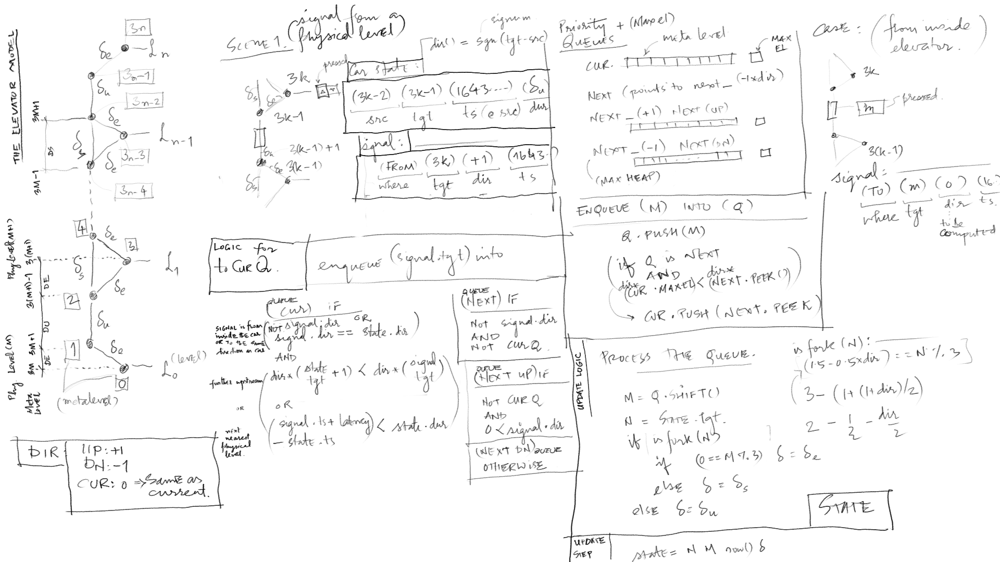
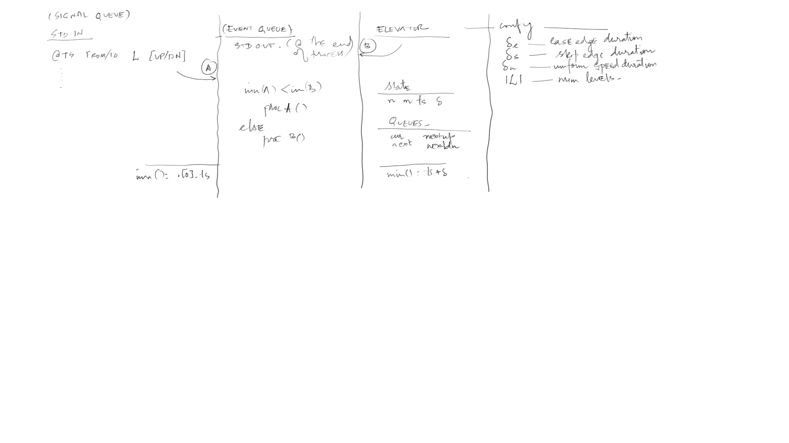
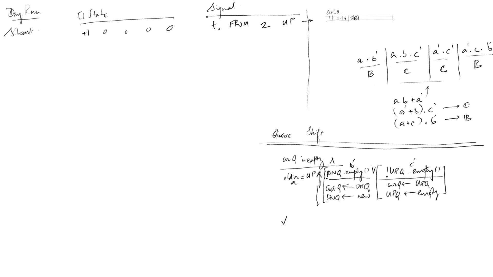

# The Elevator Pitch



## Problem ##

In a ten floor building, there's an elevator, 10
buttons inside the elevator, and two buttons on each
floor up/dn, except for top and bottom floor, which
have one button each.

Design a control mechanism for elevator in
a building.

## Usage ##
To compile and/or run:
```sh
make
```

Requires: Any C++-17 compiler. Tested with
`g++-13`. Add c++-17 to `CXXFLAGS` in `Makefile`, if
necessary.

Inputs are in `$(RUN)/in.txt`, *i.e.* `dist/run/in.txt`
by default. Please look at [sample input file
here](./sample.in.txt), and the [format details
here](#msg-input).  The corresponding out/err are
stored in [`sample.out.txt`](./sample.out.txt) and
[`sample.err.txt`](./sample.err.txt).

When not available, `$(RUN)/in.txt` is a file-copy of
[`sample.in.txt`](./sample.in.txt).

The `STDOUT` is saved in `$(RUN)/out.txt`, *i.e.*
`dist/run/out.txt`.

The `STDERR` is saved in `$(RUN)/err.txt`, *i.e.*
`dist/run/err.txt`.

## Solution ##

Divide the elevator traversal problem into decision
sub-problems, and conquer by deferring the decision
till the end of every step.  The fundamental
observation is that at some location before reaching a
given level `L`, the elevator should decide whether or
not to fork (change state from uniform speed to
deceleration) in order to stop at `L`.

This solution broadly defines,
1. Traversal between every successive levels `[L,L+1]`
  is mapped to `[3*L, 3*L+1, 3*(L+1)-1, 3*(L+1)]`,
2. `[3*L, 3*L+1]` represents an accelerating car
     state;
3. `[3*L+1, 3*(L+1)-1]` represents car at uniform
     speed;
4. `[3*(L+1)-1, 3*(L+1)]` represents a decelerating
     car;
5. `[3*L-1, 3*L+1]` represents a car at uniform speed
   not stopping (skipping) at level `L`; and
6. Assumes that the signal propagation and computation
   may incur a max latency, configurable as `LAT`.
  
We may see that each signal of stoppage would trigger a
destination insertion into a traversal path, and thus
adding the destination and shortest connecting paths.
The advantage of this solution is that while
maintaining the graph structure, the optimal paths are
baked into the algorithm like a greedy approach.

Another encoded solution is to maintain three queues,
one for each direction of traversal at any given
instant.  That is, for any given level `M=3*L+K%3`
where the car is, maintain a queue for each of the
following traversal,
+ From `M` to a signalled far-end in the direction of
  current traversal, eg. towards `3*(LMAX-1)` for `UP`;
+ From a signalled near-end to far-end in the inverse
  direction of current traversal; and 
+ From a signalled near-start to `M` in the direction
  of current traversal.

This would entail only a change of flag and queue swap
(or rotation) at every change of direction.

### Limitations and Future ###
1. This project merely emulates the message passing and
   observer pattern.  Adaptation to MPI, either using
   boost (in C++) or MP (in Python) or Event (in
   Javascript) is left to future.  Hopefully the logic
   and code organisation here, make it straight-forward
   and easy.
2. The code here makes a simplified assumption that
   duplicate target levels are inhibited before
   reaching the system.  It would be trivial to extend
   the system to include this functionality.  One way
   would be to add a couple of bitsets to the state
   vector, one for each direction, and flag it on for
   each entry popped out the signalQ, and flag it off
   for of each entry popped out of the elevator LvlQ. 
3. On initialisation, the elevator is idiosyncratic to
   rest twice.  It's a state reset artefact, which may
   hopefully be eliminated with an extra eye to detail.
4. An artificial [limit of
   `N=2000`](./src/bvr/main.cpp#L22) has been placed on
   number of loops on main for guarding against
   never-ending loops. This can be lifted as necessary.

<a id="prog-setup"></a>
## Programmatic setup ##

When the program starts, a batch input from cli
emulates [a message queue `SignalQ`](#ds-signal),
to read and parse [user side messages](#msg-input).

The elevator is essentially modelled as a tuple of
[`CONFIG`](#ds-config), [`STATE`](#ds-state) and a list
of [destination queues](#ds-dst-queues).  An elevator
is configured to decide on its tentative path as a
series of edges (of a graph).  At every end of edge,
the elevator sends *a message for state update*.

The main function emulates a controller that may
receive messages from `SignalQ` or from elevator *for
state update*.  The responsibility of action is
transferred to the respective processor.

<a id="elevator"></a>
## The Elevator Model ##

The movement of an elevator is modelled as a graph
traversal, where each physical level: `0:"G", 1:"L1",
...` is mapped onto a meta-level that is indexed as
`m=3*l`, so that `0:"G", 3:"L1",...` and the state of
traversal or rest is modelled as edges between the meta
levels and their duration of travel as edge weights.
The elevator may *stay at rest* of a pre-defined
repeatable duration `DR`, represented as a loop
`[3*m,3*m]`.

The elevator may move between two successive of
successive physical levels `[3*m, 3*(m+1)]` in three
stages.  First, by accelerating (*ease* into its
uniform speed) for a duration of `DE` thus reaching the
meta node `3*m+1`.  Second, moving with a *uniform
speed* for a duration `DU` culminating in meta node
`3*(m+1)-1`.  And finally decelerating (*ease* again
into rest) for the duration of `DE`, reaching the level
`3*(m+1)`.

When moving between two non successive levels,
`[3*i,3*j]`, the elevator would bypass *(skip)* any
intermediary level `3*k`.  This is modelled as an edge
`[3*k-1, 3*k+1]` with duration `DS`.

The total number of physical levels in the building is
abstracted as `LMAX`, so that `0,1,...,LMAX-1` represent
the physical levels, and `0,3,...,3*(LMAX-1)` represent
the corresponding meta-levels.

The signal propagation and processing may incur some
latency which is configurable (say empirically) as
`LAT`.

<a id="el-directionality"></a>
### Directionality ###
The directionality of the traversal effects the
computation defined so far, for example traversal
+ downwards from `3*M -> 3*N` would be like
  `[3*M,3*M-1,...,3*K+1,3*K-1,...,3*N+1,3*N]`; whereas 
+ upwards  from `3*M -> 3*N` would be like
  `[3*M,3*M+1,...,3*K-1,3*K+1,...,3*N-1,3*N]`.

We encode this observation as a simple algebraic
structure with meta-levels, where `(+)/(-)` is an
assymmetric overloaded operation, parameterised by
`DIR`, so that

```c++
L1 (+) L2 = L1 + DIR * L2;
L1 (-) L2 = L1 - DIR * L2;
```

Where `DIR` represents direction `{-1,+1}`, implemented
as an enumerator.

<a id="ds-config"></a>
### Config ###

The complete configuration is as follows,

+ `DE`: Ease duration,
+ `DS`: Skip duration,
+ `DU`: Duration of uniform speed,
+ `DR`: (Min) Duration of rest at a level,
+ `LAT`: Network and processing latency,
+ `LMAX`: Num levels (exclusive); example `LMAX=10`
  implies G+9.
  
For computational convenience, the timestamp and
duration types are integers that represent
milliseconds.  And `0` would mean the start of elevator
program

```c++
  enum ConfigIndexEnum { DE, DS, DU, DR, LAT, LMAX };
```

<a id="ds-dst-queues"></a>
### Destination Queues ###
The elevator model stores three queues, one for current
direction of traversal, and one each for next `UP` and
`DOWN` directions.  Each queue that stores a list of
all the destinations (meta-levels) further ahead.  It
tells (in constant time) what is the next destination
meta-level, and the maximum meta-level in the
respesective queue.

The queues are rotated once the current queue is empty,
but the current queue is synced with the next queue,
before rotating.  That is, if the start of next queue
lies ahead in the current direction, then the start of
next queue is pushed into the current queue without
rotation.

To enqueue a physical level `(3*M)` into a queue, the
following four conditions arise,
+ *Empty queue*: Insert `3*M` twice, representing the
  loop traversal at a stop. And update the max-level;
+ `3*M` within queue bounds: Just insert `3*M` twice;
+ `3*M` precedes start `(3*N)` : Insert
  `[3*M,3*M,3*M+1,...,3*K-1,3*K+1,...3*N-1]`;
+ `3*M` succeeds max-level `(3*N)` : Insert
  `[3*N+1,...,3*K-1,3*K+1,...3*M-1,3*M,3*M]`;

The [directionality trick](#el-directionality) allows
for a single function definition by storing an extra
bit of information.  Practically 4-bytes, perhaps.

<a id="ds-state"></a>
### State ###
The elevator state represents the traversal of an edge
in the current journey.  For rest, the last physical
level reached in looped-over as many times as required.

```c++
  enum ElStateIndexEnum { ELDIR, L0, L1, T0, D };
```

**Elevator state** is a 5-tuple,
+ `ELDIR`: Direction of current traversal;
+ `L0`: Origin meta-level for the current edge;
+ `L1`: Destination meta-level for the current edge;
+ `T0`: Timestamp at meta-level `L0`;
+ `D` :: Duration of travel from `L0`->`L1`;

<a id="el-signal"></a>
### Elevator Signal ###
Physically, the elevator would sync with a sensor for
reaching a specific level. Here, the signal is
dispatched with a Markovian assumption, at timestamp
`(T0+D)` to progress the elevator queue, after every
state change, and for as long as the current queue is
not empty.

<a id="msg-input"></a>
## Message Queue Input ##

The signals are read from `STDIN`, formatted as
follows,
+ One line of config;
+ Followed by N for num lines signals;
+ Followed by N lines, one for each signal.

Where each signal follows the grammar,

`TS "FROM" LVL {"UP"|"DN"}`  
or  
`TS "TO" LVL`

Where,
+ `TS`: Timestamp of signal origin;
+ `WHERE`: `"FROM"` or `"TO"`;
+ `LVL`: Target level;
+ `DIR`: `UP` or `DN`.

Please note that `"TO"` represents a button press from
inside of the elevator car, and thus inhibits direction
specification.


<a id="ds-signal"></a>
## Data Structures ##

This project uses the STL as is, and composes them
using tuples.  Novel/ adhoc structures were not
required.  The semantics may be a little strange to see
first time. E.g., A signal is defined as

```c++
// Signal -------------------------------------------
enum WhereEnum { FROM, TO };
enum DirEnum { UP=1, DN=-1, CUR=0 };
enum SignalIndexEnum { LVL, WHERE, SIGDIR, TS };
typedef std::uint64_t TsT;
typedef std::uint16_t LvlT;
typedef std::vector<LvlT> LvlV;
typedef std::tuple<LvlT,WhereEnum,DirEnum,TsT>
SignalT;
typedef std::vector<SignalT> SignalV;

// Signal Queue -------------------------------------
typedef std::priority_queue<
  SignalT,SignalV,std::greater<SignalT>
  > SignalQ;
```

A signal is defined as tuple and its members are
accessed using indexed member names as follows,

```c++
auto ts = std::get<TS>(signal);
auto &tsRef = std::get<TS>(signal);

std::get<TS>(signal) = newTs;

std::cerr << "Orig TS:" << ts << endl;
std::cerr << "New TS:" << tsRef << endl;
```

Or using a destructuring syntax, respectively for a
copy or reference, as in here:
```c++
auto [l, std::ignore, dir, ts] = signal;
auto &[lRef, wRef, dirRef, tsRef] = signal;
```

## Code Organisation ##

All structure definitions are enlisted in
[`elevator.hpp`](./src/bvr/elevator.hpp)

[`main.cpp`](./src/bvr/main.cpp) encodes delegating a
message from queue to its corresponding processor.
Messages may either be from the signal queue or from
the elevator queue.

[`input.cpp`](./src/bvr/input.cpp) encodes the user
message parsing.

[`elevator.cpp`](./src/bvr/elevator.cpp) encodes the
elevator model, factory setup and queue rotation logic.

[`signal.cpp`](./src/bvr/signal.cpp) contains the
signal comparison definition. Just allows for the
unordered input of signals.

[`debug.cpp`](./src/bvr/debug.cpp) output routines.

[`coroutine.cpp`](./src/bvr/coroutine.cpp) encodes the
processor for each message from corresponding queue.


## Caveats ##

1. The compiler should support `#pragma once`
   directive. For GCC, it's available since v3.4.
2. ~~Using boost::variant. This is to accommodate
   min-heaps as well as max-heaps in the same
   pointer.~~ Instead, use a generic comparator that
   stores state.

## Scratchpads ##





